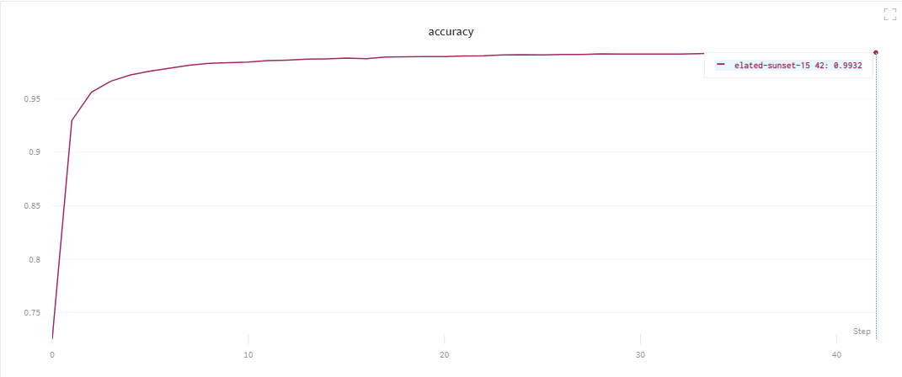

# [WIEiK - SI - L03] Convolutional Neural Network

## Task 1

### Accuracy: **99.32%**

[https://app.wandb.ai/kasperski95/wieik-si-lab-cnn/reports/Task-1--Vmlldzo4MDM2Mw](https://app.wandb.ai/kasperski95/wieik-si-lab-cnn/reports/Task-1--Vmlldzo4MDM2Mw)

## Task 2 - VGG16 vs ResNet-50

### VGG16

| Dog                 | Doggo               | Muffin                 |
| ------------------- | ------------------- | ---------------------- |
| Chihuahua (86.35%)  | cowboy_hat (34.40%) | custard_apple (61.31%) |
| Pomeranian (7.64%)  | Pembroke (22.56%)   | bagel (22.31%)         |
| toy_terrier (1.04%) | Chihuahua (13.98%)  | teddy (9.95%)          |

### ResNet-50

| Dog                    | Doggo               | Muffin                 |
| ---------------------- | ------------------- | ---------------------- |
| Chihuahua (35.97%)     | Pomeranian (28.11%) | teddy (47.30%)         |
| Dandie_Dinmont (9.16%) | Chihuahua (23.00%)  | French_loaf (17.43%)   |
| -                      | Pembroke (21.34%)   | custard_apple (10.68%) |
